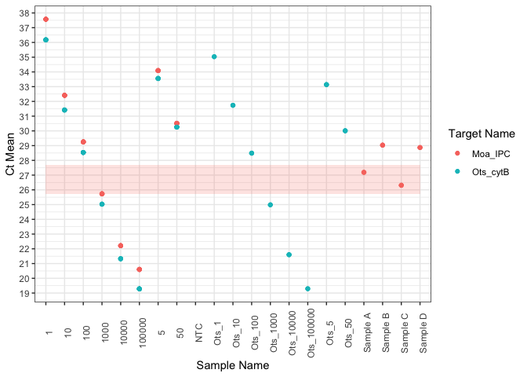
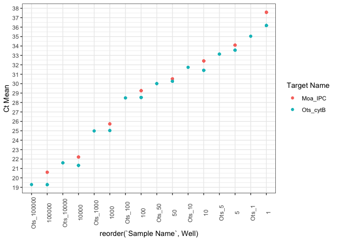

2023-test-samples
================
2023-11-01

October 2023

Four extracts sent from Amelie at UC Davis to see if 1) they are
inhibited and 2) we detect Chinook.

``` r
library(tidyverse)
```

    ## ── Attaching core tidyverse packages ──────────────────────── tidyverse 2.0.0 ──
    ## ✔ dplyr     1.1.3     ✔ readr     2.1.4
    ## ✔ forcats   1.0.0     ✔ stringr   1.5.0
    ## ✔ ggplot2   3.4.3     ✔ tibble    3.2.1
    ## ✔ lubridate 1.9.3     ✔ tidyr     1.3.0
    ## ✔ purrr     1.0.2     
    ## ── Conflicts ────────────────────────────────────────── tidyverse_conflicts() ──
    ## ✖ dplyr::filter() masks stats::filter()
    ## ✖ dplyr::lag()    masks stats::lag()
    ## ℹ Use the conflicted package (<http://conflicted.r-lib.org/>) to force all conflicts to become errors

``` r
library(readxl)
```

Quick look at chinook:

``` r
mccloud <- read_xlsx("../data/2023-10-20_McCloudChinook_reDo.xlsx", sheet = "Results", skip = 34)

ch_p <- mccloud %>%
  #filter(`Target Name` == "Moa_IPC") %>%
  ggplot(aes(x =`Sample Name` , y = `Ct Mean` , color = `Target Name`)) +
  geom_point() +
  theme_bw() +
  theme(
    axis.text.x = element_text(angle = 90)
  ) +
  #facet_grid(rows = vars(`Target Name`))  +
  scale_y_continuous(breaks = seq(18,40, 1)) 

ch_p + annotate("rect", xmin = "1", xmax = "Sample D", ymin = 25.7, ymax = 27.7, alpha = 0.2, fill = "salmon")
```

    ## Warning: Removed 20 rows containing missing values (`geom_point()`).

<!-- -->

``` r
mccloud %>%
  filter(Task == "STANDARD" &
           `Target Name` == "Moa_IPC" &
           `Sample Name` == "1000")
```

    ## # A tibble: 6 × 31
    ##    Well `Well Position` Omit  `Sample Name` `Target Name` Task     Reporter
    ##   <dbl> <chr>           <chr> <chr>         <chr>         <chr>    <chr>   
    ## 1    28 C4              false 1000          Moa_IPC       STANDARD VIC     
    ## 2    29 C5              false 1000          Moa_IPC       STANDARD VIC     
    ## 3    30 C6              false 1000          Moa_IPC       STANDARD VIC     
    ## 4    31 C7              false 1000          Moa_IPC       STANDARD VIC     
    ## 5    32 C8              false 1000          Moa_IPC       STANDARD VIC     
    ## 6    34 C10             false 1000          Moa_IPC       STANDARD VIC     
    ## # ℹ 24 more variables: Quencher <chr>, CT <chr>, `Ct Mean` <dbl>,
    ## #   `Ct SD` <dbl>, Quantity <dbl>, `Quantity Mean` <dbl>, `Quantity SD` <dbl>,
    ## #   `Automatic Ct Threshold` <chr>, `Ct Threshold` <dbl>,
    ## #   `Automatic Baseline` <chr>, `Baseline Start` <dbl>, `Baseline End` <dbl>,
    ## #   Comments <lgl>, `Y-Intercept` <dbl>, `R(superscript 2)` <dbl>, Slope <dbl>,
    ## #   `Amp Score` <dbl>, `Cq Conf` <dbl>, `Amp Status` <chr>, EXPFAIL <chr>,
    ## #   HIGHSD <chr>, NOAMP <chr>, THOLDFAIL <chr>, OUTLIERRG <chr>

``` r
mccloud %>%
  filter(Task == "STANDARD") %>%
  arrange(Well) %>%
   ggplot(aes(x = reorder(`Sample Name`, Well), y = `Ct Mean` , color = `Target Name`)) +
  geom_point() +
  theme_bw() +
  theme(
    axis.text.x = element_text(angle = 90)
  ) +
  #facet_grid(rows = vars(`Target Name`))  +
  scale_y_continuous(breaks = seq(18,40, 1)) 
```

<!-- -->

Less consistent quantification at 1 copy. That’s totally reasonable.

Assay efficiency?

``` r
mccloud %>%
  mutate(efficiency = -1 + 10^ (-1/Slope)) %>%
  group_by(`Target Name`) %>%
  summarise(E = mean(efficiency))
```

    ## # A tibble: 2 × 2
    ##   `Target Name`     E
    ##   <chr>         <dbl>
    ## 1 Moa_IPC       1.00 
    ## 2 Ots_cytB      0.988

Those are pretty fantastic values.
